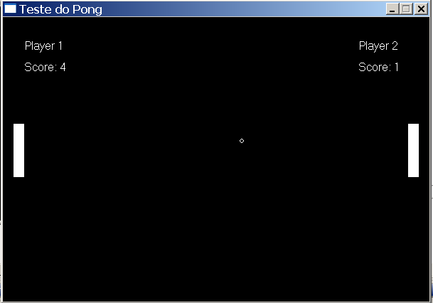

# Pong (C language)



OVERVIEW
--------------------------------------------------
This is an implementation of a pong game for the [Introduction to Computer Science I
][ICC1]. The purpose of this project was to develop a retro game using the C language programming and Borland Graphics Library (graphics.h) which was known in the old days of MS-DOS.  It was made in the course of Computer Science (ICMC - USP).

BUILD AND INSTALL
--------------------------------------------------

Clone Pong repository:

```bash
  $ git clone https://github.com/wesjrock/pong.git
```

Compiling and Running Pong:

```bash
  The easiest way to compile the code is through Codeblocks-Edu-Portable (Windows Only) which is
  Codeblocks IDE that has support to 2D/3D graphics libraries like graphics.h and GLUT
  (This version of codeblocks includes GCC 4.4.5).
  You can find Codeblocks-Edu-Portable on <http://codeblocks.codecutter.org/>
  
  After installing Codeblocks-EP, follow the steps below:
  'File' -> 'New Project' -> 'WinBGim project'
  
  After creating and naming the project (Graphics only), click on the 'Project' tab and then 'Add files'
  Now you must add 'main.cpp' and 'block.bmp' files to the project.
  
  Press 'Build and Run'
```

HOW TO PLAY
--------------------------------------------------

```bash
  PLAYER 1: W A S D
  PLAYER 2: UP DOWN RIGHT LEFT
```

MORE INFO
--------------------------------------------------

* pong: <https://en.wikipedia.org/wiki/Pong>
* graphics.h library: <https://en.wikipedia.org/wiki/Borland_Graphics_Interface>
